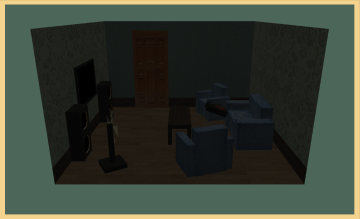

# Simple WebGL Room


It is a simple WebGL practice of making a room.  
Pressing few keyboard buttons, you can interact with the model with some animations.



## How to run
1. The texture render only works when the CORS approval, so try it out on local server.
2. Move to the directory where this README file is.
3. If python installed (ver3.0 upper), run local server :
    ```bash
    # command line
    python -m http.server
    ```
4. In browser, access `localhost:8000/source/room.html`.

